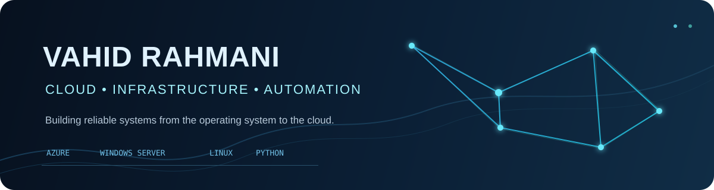
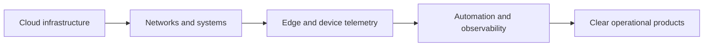

### Cloud Engineer Trainee · Azure · Windows Server · Linux · Python

Hamburg, Germany · Building practical infrastructure and automation projects

## Profile

I build and document hands-on systems across cloud infrastructure, Windows and Linux administration, networking, edge devices, and automation. My projects are small enough to understand, practical enough to demonstrate, and structured so another engineer can reproduce the setup.

## What I work with

| Focus | Tools and practice |
| --- | --- |
| Cloud infrastructure | Microsoft Azure, Azure Monitor, Log Analytics, hybrid architecture |
| Systems | Windows Server, Active Directory, PowerShell, Linux administration |
| Networking | DNS, reachability, infrastructure monitoring, troubleshooting |
| Automation | Python, Bash, REST APIs, repeatable operational workflows |
| Edge & IoT | Raspberry Pi, ESP32 direction, telemetry and local monitoring |
| Applied AI systems | RAG, LangGraph, multi-agent workflows, evaluation and safe tool use |
| Web delivery | React, TypeScript, Vite, Tailwind CSS, Vercel |

## Engineering focus

I care about measurable behaviour, least-privilege access, useful documentation, and a clear distinction between what is implemented today and what is planned next.

## Featured projects

### Infrastructure and cloud

- [Automated Hybrid Network & Monitoring Dashboard](https://github.com/Vahid-Rahmani/Automated-Hybrid-Network-Monitoring-Dashboard) — Active Directory discovery, reachability checks, Windows host metrics, and a FastAPI dashboard.
- [Cloud-Connected Hardware & AI Monitoring](https://github.com/Vahid-Rahmani/Cloud-Connected-Hardware-IoT-Monitor) — Raspberry Pi and hardware-monitoring foundation with a documented edge/cloud roadmap.
- [Azure AI Specialist](https://github.com/Vahid-Rahmani/Azure-AI-Specialist-Project-Plan) — Azure knowledge collection, data curation, evaluation, and RAG/model strategy.

### Automation and products

- [MultiAgentCoding](https://github.com/Vahid-Rahmani/mullti_agent_coding) — visual workflow control plane for multi-agent coding operations.
- [LinkedIn Activity Assistant](https://github.com/Vahid-Rahmani/agent-for-linkdin) — local activity monitoring, GitHub-based content preparation, reporting, and browser automation.
- [AI Drop Agent](https://github.com/Vahid-Rahmani/AI-Drop-Agent) — modular market research, supplier checks, fee calculation, and opportunity ranking.
- [Zova](https://github.com/Vahid-Rahmani/dobzova) — Chrome classroom assistant with transcription, translation, study support, and local class history.

## Portfolio and learning

- [Live portfolio](https://vahid-portfolio-three.vercel.app/) — selected work, technical direction, and project case studies.
- [Zova product site](https://zovasite.vercel.app/) — product overview, installation guide, privacy, and support.
- Current learning direction: Azure infrastructure, Windows Server, Linux/RHCSA preparation, networking/CCNA practice, Python automation, and cloud operations.

## Working principles

- Document the real implementation, not an imagined architecture.
- Prefer secure defaults and keep credentials outside repositories.
- Validate infrastructure changes with repeatable checks.
- Keep automation observable, bounded, and reversible.
- Build projects that are easy for a teammate or recruiter to inspect.

## Connect

If you are hiring for a junior cloud, infrastructure, systems, or automation role, I would be glad to connect.

[LinkedIn](https://www.linkedin.com/in/vahid-rahmani-699944417/) · [Portfolio](https://vahid-portfolio-three.vercel.app/) · [GitHub repositories](https://github.com/Vahid-Rahmani?tab=repositories)

